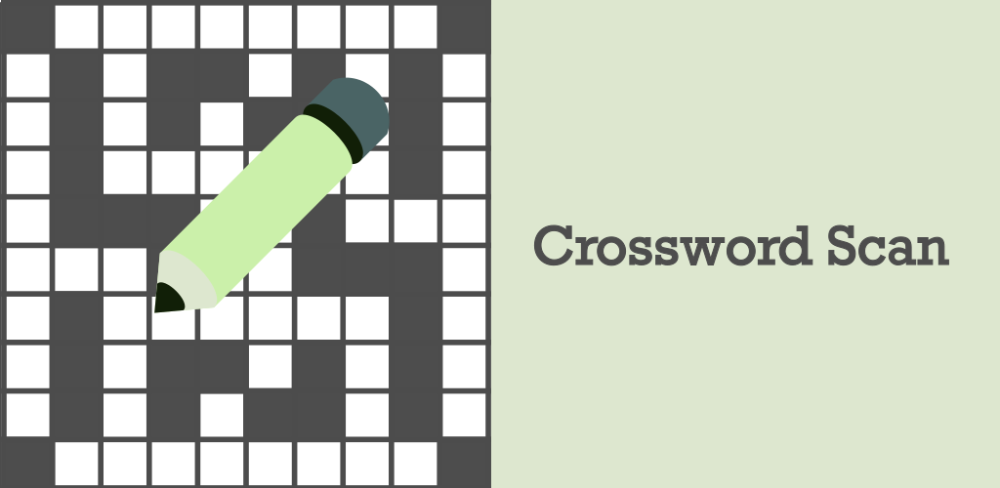

# Crossword Scan

--
Crossword Scan is an Android app that brings physical crosswords into the digital realm, enabling on-the-go solving and sharing with your friends. Under the hood, Crossword Scan is written in Kotlin, uses Jetpack Compose and leverages classical image processing algorithms alongside modern machine-learning approaches from Google's ML kit. A REST API was developed for sharing puzzles across devices, and the source code for that can be found [here](https://github.com/jhb123/PuzzleServer).
## Screen Demos
 Scanning grids |  Scanning clues | Interacting with the crossword 
 :--: | :--: | :--: 
|| |

Dark mode |  Light mode | Authentication Scren
 :--: | :--: | :--: 
||

## Image Processing Pipeline

The image processing pipeline used to detect the crossword grid was implemented with OpenCV. Below is an image of how this pipeline works.

This pipeline was originally developed in Python, and that can project can be found here: https://github.com/jhb123/crosswordScan

